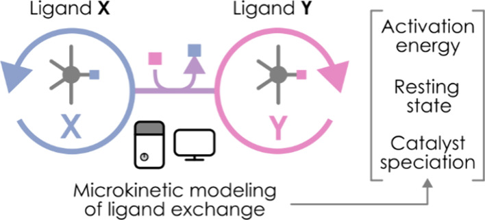
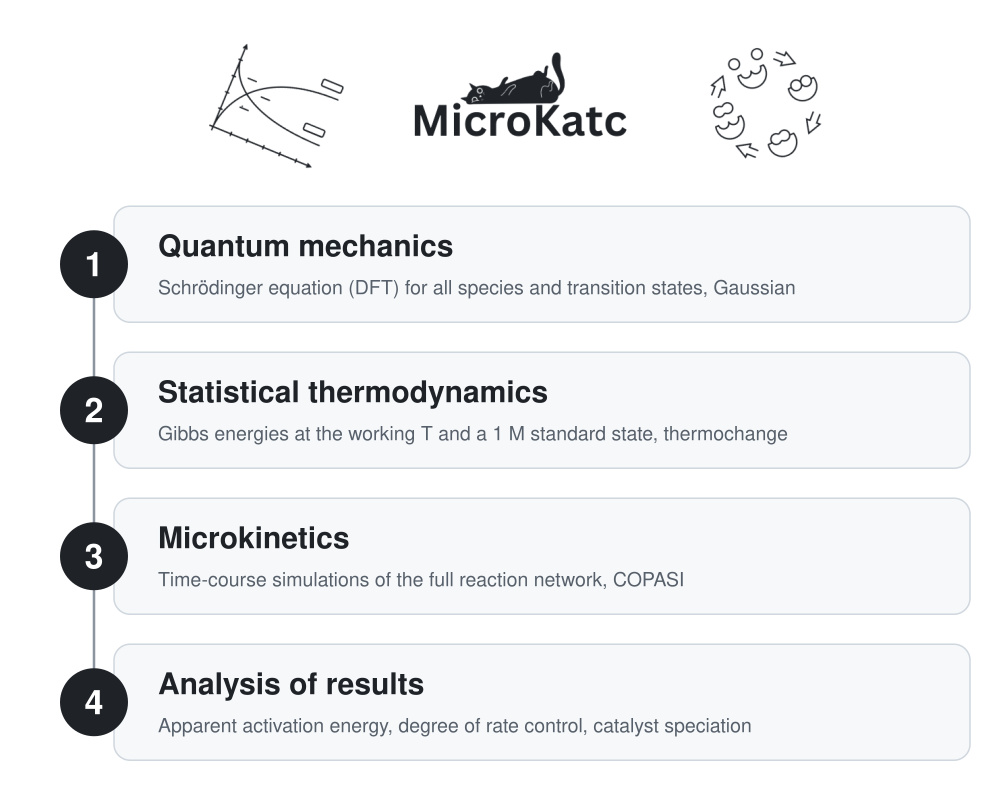
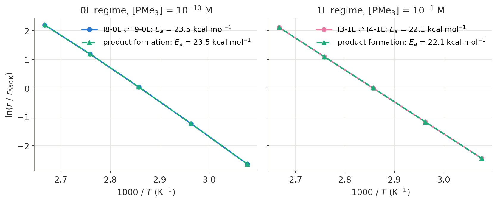
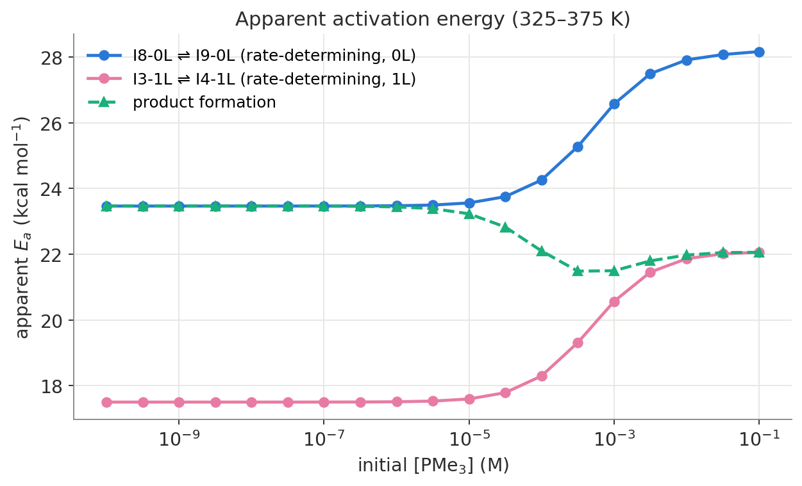
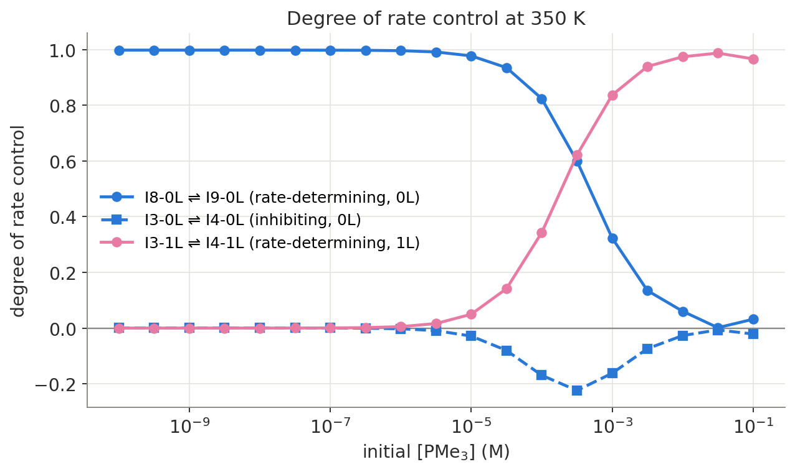
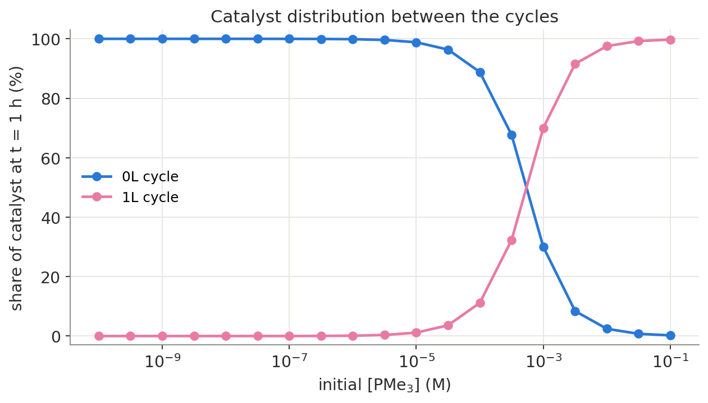
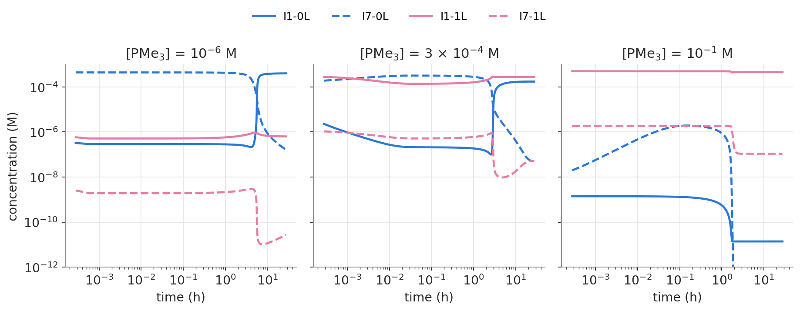
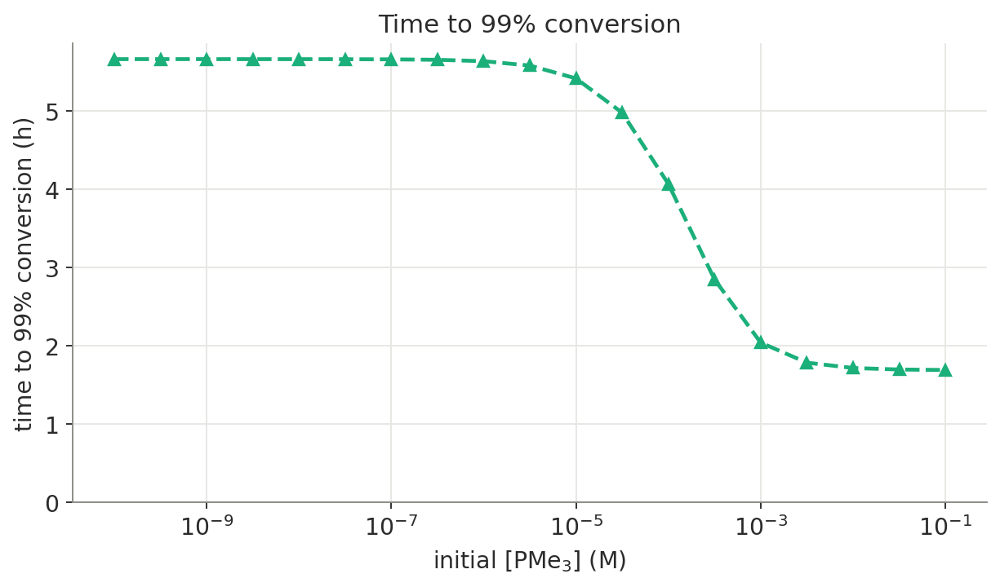
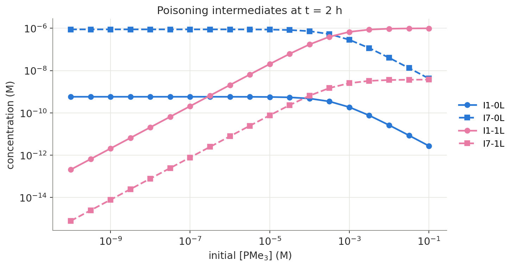

<h1 align="center">MicroKatc</h1>

<p align="center">
  <b>Automated microkinetic analysis of interconnected catalytic cycles, from DFT outputs to mechanistic insight.</b>
  <br/><br/>
  <a href="https://doi.org/10.1021/acscatal.5c00348"></a>
  <a href="https://doi.org/10.1021/acscatal.5c00348"></a>
  <a href="https://github.com/0rkhann/MicroKatc/actions/workflows/tests.yml"></a>
  
  <a href="LICENSE"></a>
  <br/><br/>
  <a href="https://doi.org/10.1021/acscatal.5c00348"></a>
  <br/>
  <sub>Graphical abstract © 2025 the authors, <i>ACS Catal.</i> 15, 4739, <a href="https://creativecommons.org/licenses/by-nc-nd/4.0/">CC BY-NC-ND 4.0</a></sub>
</p>

MicroKatc turns a set of Gaussian calculations and a list of elementary steps into a complete kinetic picture of a catalytic system. It computes thermally corrected Gibbs energies, builds and runs COPASI microkinetic models, and then answers the questions a mechanistic study needs: **which steps control the rate, how the apparent activation energy responds to reaction conditions, and where the catalyst actually spends its time.**

The approach is published in:

> O. Abdullayev, D. Garay-Ruiz, B. Bori-Bru, C. Bo. "Microkinetic Assessment of Ligand-Exchanging Catalytic Cycles." *ACS Catal.* **2025**, *15* (6), 4739–4745. [doi:10.1021/acscatal.5c00348](https://doi.org/10.1021/acscatal.5c00348)

## Highlights

- **End-to-end pipeline:** raw DFT output files in, publication-ready figures out, driven by one script.
- **Apparent activation energy (E<sub>a</sub>)** from Arrhenius fits of every step's flux and every species' rate of change, swept over temperature and over the concentration of any chosen reactant.
- **Degree of rate control (DRC)** for every elementary step, by central finite differences parallelised across CPU cores, to identify the rate-determining and inhibiting steps.
- **Multi-cycle catalyst tracking:** the catalyst concentration in each competing cycle (for example 0-ligand vs. 1-ligand cycles) as conditions change.
- **Conversion-time analysis:** time to reach a set product yield as a function of reactant concentration.
- **Result caching:** simulations and fitted parameters are saved as CSV files and reused, so long parameter sweeps never repeat finished work.

## How it works

<p align="center">
  <picture>
    <source media="(prefers-color-scheme: dark)" srcset="pics/pipeline-dark.svg"/>
    
  </picture>
</p>

| Module | Role |
| --- | --- |
| [`main.py`](main.py) | Entry point; all analysis parameters are set here |
| [`get_G_compounds.sh`](get_G_compounds.sh), [`calculating_G_for_microkinetics.py`](calculating_G_for_microkinetics.py) | Thermochemistry: G of each species and the forward/reverse barrier of each step |
| [`microkinetics_simulation.py`](microkinetics_simulation.py) | COPASI simulations with convergence checks and caching; catalyst and conversion analyses |
| [`apparent_activation_energy.py`](apparent_activation_energy.py) | Apparent E<sub>a</sub> fits and DRC calculation |
| [`plotting_functions.py`](plotting_functions.py) | All figures |

## Case study: Rh-catalysed hydroformylation

<p align="center">
  
</p>

The example data in this repository model the hydroformylation of ethene by a homogeneous rhodium catalyst. Two cycles compete: one without (0L) and one with (1L) a coordinated PMe<sub>3</sub> ligand. The analysis varies the initial PMe<sub>3</sub> concentration (`reactant_to_study = "PMe3"`).

**Key findings**

- Adding PMe<sub>3</sub> shifts the catalyst from the 0L cycle into the 1L cycle. The 1L cycle has lower activation energies, becomes the main source of product, and reaches 99 % conversion much faster.
- The rate-determining step moves with the conditions: I8_0L ⇌ I9_0L controls the rate at low PMe<sub>3</sub>, and I3_1L ⇌ I4_1L takes over at high PMe<sub>3</sub>. The negative DRC of I3_0L ⇌ I4_0L shows that this step inhibits the 0L cycle.
- More PMe<sub>3</sub> also releases more CO, which poisons the catalyst at the I6 ⇌ I7 steps. This is why the E<sub>a</sub> of the rate-determining steps rises and then plateaus.

All figures below are built by [`readme_figures.py`](readme_figures.py) from the results `main.py` saves. Blue is the 0L cycle, pink the 1L cycle and green the product. `main.py` also writes the full versions, for every step and every concentration, to `microkinetics_simulations_images/`.

### 1. Arrhenius check

<p align="center">
  
</p>

The apparent E<sub>a</sub> comes from the slope of ln(r) against 1/T over 325–375 K, which is valid at low catalyst concentration. In each regime, product formation follows the same straight line as its rate-determining step, so the two share one E<sub>a</sub>. `main.py` draws this plot for every step and keeps those with R<sup>2</sup> > 0.9.

### 2. Apparent activation energy

<p align="center">
  
</p>

The E<sub>a</sub> of both rate-determining steps rises with PMe<sub>3</sub> and then plateaus as the catalyst saturates with PMe<sub>3</sub>. The rise comes from CO release: more PMe<sub>3</sub> frees more CO, which poisons the catalyst at the I6 ⇌ I7 steps. E<sub>a</sub> is lower in the 1L cycle than in the 0L cycle, so the 1L cycle has faster kinetics and takes over product formation. The product's E<sub>a</sub> therefore falls from 23.5 to about 21.5 kcal mol<sup>-1</sup>, then settles at the 1L value of 22.1 kcal mol<sup>-1</sup>.

### 3. Degree of rate control

<p align="center">
  
</p>

I8_0L ⇌ I9_0L controls the rate in the 0L cycle, but it loses importance as the 1L cycle becomes active. The DRC of I3_1L ⇌ I4_1L grows with PMe<sub>3</sub>, making it the controlling step at high concentration. The DRC of I3_0L ⇌ I4_0L turns negative in the transition region, which shows that this step inhibits the 0L cycle.

### 4. Catalyst distribution

<p align="center">
  
</p>

The share of the catalyst in each cycle at t = 1 h, with 5 × 10<sup>-4</sup> M catalyst. Beyond about 5 × 10<sup>-4</sup> M PMe<sub>3</sub>, most of the catalyst is in the 1L cycle.

### 5. Concentration profiles

<p align="center">
  
</p>

The resting states I1 and I7 of both cycles over time, at low, intermediate and high PMe<sub>3</sub>. As PMe<sub>3</sub> increases, the catalyst moves from the 0L species into their 1L counterparts.

### 6. Time to 99 % conversion

<p align="center">
  
</p>

The time for the product to reach 99 % of the maximum allowed by the limiting reactant (the threshold is adjustable). It drops from 5.7 h with the 0L cycle alone to 1.7 h once the 1L cycle takes over.

### Putting it together

<p align="center">
  
</p>

Why does the E<sub>a</sub> of the 1L rate-determining step increase (figure 2) even though the 1L cycle becomes more active? As PMe<sub>3</sub> increases, I3_0L ⇌ I4_0L inhibits the 0L cycle and pushes the catalyst into the 1L cycle (figure 3). At the same time, the poisoning intermediates of the 0L cycle (I1_0L, I7_0L) decrease, and those of the 1L cycle (I1_1L, I7_1L) build up (above, at the low catalyst concentration of the E<sub>a</sub> analysis). Product formation in the 1L cycle therefore gets harder, which raises its E<sub>a</sub>.

## Reproducing the paper

With the settings in `main.py`, a full run takes a few minutes and reproduces the published results:

| Published result | Paper | This code |
| --- | --- | --- |
| Gibbs barriers of all 22 steps at 5 temperatures (SI Tables S1–S5) | 0.1 kcal mol<sup>-1</sup> precision | identical |
| Time to 99 % conversion, 0L only → 1L (Figure 4) | 5.66 h → 1.69 h | 5.67 h → 1.69 h |
| Apparent E<sub>a</sub> of product formation (Figure 6) | 23.5 → 21.4 → 22.1 kcal mol<sup>-1</sup> | 23.5 → 21.5 → 22.1 kcal mol<sup>-1</sup> |
| Minimum DRC of I3_0L ⇌ I4_0L (Figure 5) | −0.22 at 3 × 10<sup>-4</sup> M | −0.22 at 3 × 10<sup>-4</sup> M |

[`tests/test_paper_barriers.py`](tests/test_paper_barriers.py) checks the barriers against SI Table S3 on every run with thermochange installed.

## Quick start

### 1. Install dependencies

MicroKatc relies on two packages by D. Garay-Ruiz:

```bash
git clone https://gitlab.com/dgarayr/thermochange.git    # thermochemical corrections
git clone https://gitlab.com/dgarayr/copasi_helper.git   # COPASI model building and simulation
git clone https://github.com/0rkhann/MicroKatc.git
```

Then, inside a Python 3.10 virtual environment, install the Python requirements. They include the COPASI Python bindings (`python-copasi`) and the pinned copasi_helper commit:

```bash
cd MicroKatc
python3.10 -m venv .venv && source .venv/bin/activate
pip install -r requirements.txt
```

### 2. Prepare inputs

1. Put the Gaussian `.out` file of every species and transition state in `GaussOutputFiles/`.
2. List the elementary steps in `reactions.csv`, one per row, with the transition state in the `TS` column. Use `-` for a barrierless step. See the provided example.

### 3. Run

```bash
export thermochange=/path/to/thermochange   # must be exported so get_G_compounds.sh can see it
python3 main.py
```

Every analysis parameter (temperatures, concentration ranges, simulation times, the reactant to study, the number of cores for DRC) is set and commented in [`main.py`](main.py).

## Modelling assumptions

1. **Electronic structure:** species were computed with DFT at the ωB97X-D/6-311G(d,p) level.
2. **Standard state:** the pressure is set from the temperature so that the ideal-gas concentration is 1 M, approximating a liquid medium: $C = \frac{P}{RT}$.
3. **Barrierless steps:** steps without a located transition state are treated as diffusion-controlled, with a barrier of 4 kcal/mol (Besora et al., 2018).
4. **Network topology:** only the listed steps between neighbouring intermediates are included. Cross-cycle or non-neighbour transformations are not modelled.
5. **Apparent E<sub>a</sub>:** at low catalyst concentration, the rate constant $k_i$ in the linearised Arrhenius equation can be replaced by the step flux $r_i$ or the species rate $v_i$:

$$\ln r_i = \ln A - \frac{E_a}{RT}, \qquad \ln v_i = \ln A - \frac{E_a}{RT}$$

## Citation

If you use MicroKatc in your work, please cite:

```bibtex
@article{Abdullayev2025,
  author  = {Abdullayev, Orkhan and Garay-Ruiz, Diego and Bori-Bru, Berta and Bo, Carles},
  title   = {Microkinetic Assessment of Ligand-Exchanging Catalytic Cycles},
  journal = {ACS Catalysis},
  year    = {2025},
  volume  = {15},
  number  = {6},
  pages   = {4739--4745},
  doi     = {10.1021/acscatal.5c00348}
}
```

Citation metadata is also in [`CITATION.cff`](CITATION.cff); GitHub shows it under "Cite this repository".

## Acknowledgements

MicroKatc was developed during a summer research stay at [ICIQ](https://iciq.org/). I sincerely thank my supervisor, Dr. Diego Garay-Ruiz, and Principal Investigator, Prof. Carles Bo, for their guidance and support. I also thank my fellow summer research colleagues, who became dear friends and made the experience truly memorable.

## License

[MIT](LICENSE)
